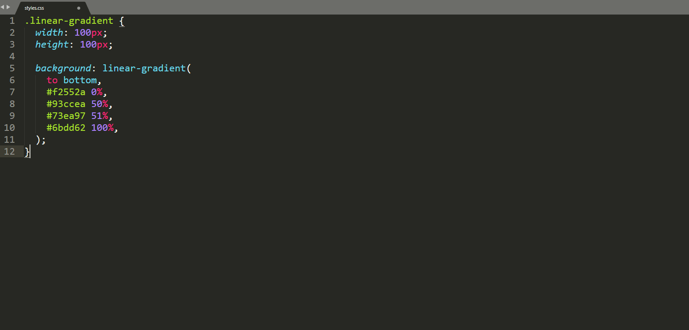

# DeclareThatColor

DeclareThatColor is a Sublime Text 3 plugin that aims to help developers declare CSS hex codes to their human-readable color names (based on Chirag Mehta's [name that color](http://chir.ag/projects/name-that-color/) tool).

[](https://codeclimate.com/github/bertdida/DeclareThatColor/maintainability)  



## Installation
Download [Package Control](https://packagecontrol.io/) and use the Package Control: Install Package command from the command palette. In this way, DeclareThatColor will stay up to date automatically.

## Usage
- To declare hex codes, click on Edit → Declare That Color.
- To revert declarations, click on Edit → Undeclare That Color.

### Key bindings

DeclareThatColor doesn't ship with default key bindings, but you can use the template below to set up your own.

```json
[
  { "keys": ["Your shortcut"], "command": "declare_that_color" },
  { "keys": ["Your shortcut"], "command": "undeclare_that_color" }
]
```